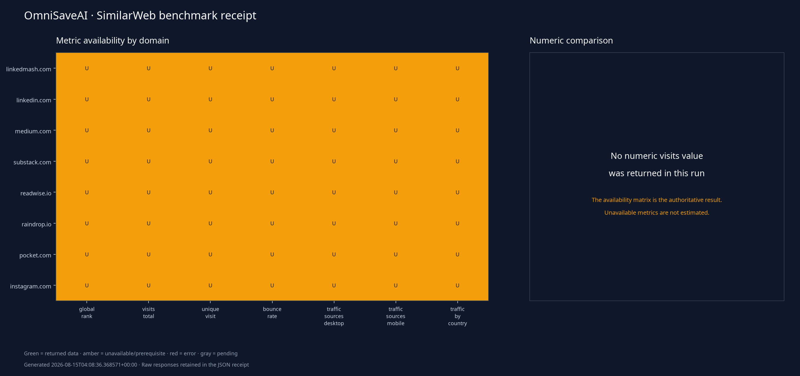

# OmniSaveAI SimilarWeb Benchmark

**Generated:** `2026-08-15T04:08:36.368571+00:00`
**Scope:** Eight domains × seven SimilarWeb metric families.
**Interpretation rule:** unavailable or error responses are reported as-is; no traffic, ranking, engagement, source, or country value is inferred when the API does not return a usable metric.

## Run summary

| Status | Metric records | Meaning |
|---|---:|---|
| Success | 0 | SimilarWeb returned a response treated as usable. |
| Unavailable | 56 | SimilarWeb reported a missing metric, credit/prerequisite limitation, or unavailable response. |
| Error | 0 | The call failed or returned an error-shaped response. |
| Pending | 0 | No call receipt exists yet. |

## Domain × metric receipt

| Domain | Global rank | Visits | Unique visit | Bounce rate | Desktop sources | Mobile sources | Traffic by country |
|---|---|---|---|---|---|---|---|
| linkedmash.com | Unavailable — SimilarWeb returned an unavailable-metric or credit/prerequisite response. | Unavailable — SimilarWeb returned an unavailable-metric or credit/prerequisite response. | Unavailable — SimilarWeb returned an unavailable-metric or credit/prerequisite response. | Unavailable — SimilarWeb returned an unavailable-metric or credit/prerequisite response. | Unavailable — SimilarWeb returned an unavailable-metric or credit/prerequisite response. | Unavailable — SimilarWeb returned an unavailable-metric or credit/prerequisite response. | Unavailable — SimilarWeb returned an unavailable-metric or credit/prerequisite response. |
| linkedin.com | Unavailable — SimilarWeb returned an unavailable-metric or credit/prerequisite response. | Unavailable — SimilarWeb returned an unavailable-metric or credit/prerequisite response. | Unavailable — SimilarWeb returned an unavailable-metric or credit/prerequisite response. | Unavailable — SimilarWeb returned an unavailable-metric or credit/prerequisite response. | Unavailable — SimilarWeb returned an unavailable-metric or credit/prerequisite response. | Unavailable — SimilarWeb returned an unavailable-metric or credit/prerequisite response. | Unavailable — SimilarWeb returned an unavailable-metric or credit/prerequisite response. |
| medium.com | Unavailable — SimilarWeb returned an unavailable-metric or credit/prerequisite response. | Unavailable — SimilarWeb returned an unavailable-metric or credit/prerequisite response. | Unavailable — SimilarWeb returned an unavailable-metric or credit/prerequisite response. | Unavailable — SimilarWeb returned an unavailable-metric or credit/prerequisite response. | Unavailable — SimilarWeb returned an unavailable-metric or credit/prerequisite response. | Unavailable — SimilarWeb returned an unavailable-metric or credit/prerequisite response. | Unavailable — SimilarWeb returned an unavailable-metric or credit/prerequisite response. |
| substack.com | Unavailable — SimilarWeb returned an unavailable-metric or credit/prerequisite response. | Unavailable — SimilarWeb returned an unavailable-metric or credit/prerequisite response. | Unavailable — SimilarWeb returned an unavailable-metric or credit/prerequisite response. | Unavailable — SimilarWeb returned an unavailable-metric or credit/prerequisite response. | Unavailable — SimilarWeb returned an unavailable-metric or credit/prerequisite response. | Unavailable — SimilarWeb returned an unavailable-metric or credit/prerequisite response. | Unavailable — SimilarWeb returned an unavailable-metric or credit/prerequisite response. |
| readwise.io | Unavailable — SimilarWeb returned an unavailable-metric or credit/prerequisite response. | Unavailable — SimilarWeb returned an unavailable-metric or credit/prerequisite response. | Unavailable — SimilarWeb returned an unavailable-metric or credit/prerequisite response. | Unavailable — SimilarWeb returned an unavailable-metric or credit/prerequisite response. | Unavailable — SimilarWeb returned an unavailable-metric or credit/prerequisite response. | Unavailable — SimilarWeb returned an unavailable-metric or credit/prerequisite response. | Unavailable — SimilarWeb returned an unavailable-metric or credit/prerequisite response. |
| raindrop.io | Unavailable — SimilarWeb returned an unavailable-metric or credit/prerequisite response. | Unavailable — SimilarWeb returned an unavailable-metric or credit/prerequisite response. | Unavailable — SimilarWeb returned an unavailable-metric or credit/prerequisite response. | Unavailable — SimilarWeb returned an unavailable-metric or credit/prerequisite response. | Unavailable — SimilarWeb returned an unavailable-metric or credit/prerequisite response. | Unavailable — SimilarWeb returned an unavailable-metric or credit/prerequisite response. | Unavailable — SimilarWeb returned an unavailable-metric or credit/prerequisite response. |
| pocket.com | Unavailable — SimilarWeb returned an unavailable-metric or credit/prerequisite response. | Unavailable — SimilarWeb returned an unavailable-metric or credit/prerequisite response. | Unavailable — SimilarWeb returned an unavailable-metric or credit/prerequisite response. | Unavailable — SimilarWeb returned an unavailable-metric or credit/prerequisite response. | Unavailable — SimilarWeb returned an unavailable-metric or credit/prerequisite response. | Unavailable — SimilarWeb returned an unavailable-metric or credit/prerequisite response. | Unavailable — SimilarWeb returned an unavailable-metric or credit/prerequisite response. |
| instagram.com | Unavailable — SimilarWeb returned an unavailable-metric or credit/prerequisite response. | Unavailable — SimilarWeb returned an unavailable-metric or credit/prerequisite response. | Unavailable — SimilarWeb returned an unavailable-metric or credit/prerequisite response. | Unavailable — SimilarWeb returned an unavailable-metric or credit/prerequisite response. | Unavailable — SimilarWeb returned an unavailable-metric or credit/prerequisite response. | Unavailable — SimilarWeb returned an unavailable-metric or credit/prerequisite response. | Unavailable — SimilarWeb returned an unavailable-metric or credit/prerequisite response. |

## LinkedMash-informed reading

The benchmark is designed to compare the product ecosystem around LinkedIn saved-content workflows, not to make claims about product quality from traffic alone. LinkedMash’s strongest workflow signals remain its browser-session capture, full-history import, new-save synchronization, thread capture, rediscovery, and portable exports. OmniSaveAI should use those as workflow benchmarks while preserving its multi-platform, career-context, evidence, and read-only agent boundaries.

## Caveats

SimilarWeb data is constrained by the API’s historical window, monthly granularity, geography behavior, and account-level metric availability. The collector saves each receipt immediately after the corresponding call, so a later failure does not erase earlier results. Re-running the script retries non-success records and skips previously successful records unless `--force` is supplied.

## References

1. [SimilarWeb Analytics skill guidance](https://www.similarweb.com/)
2. [LinkedMash product findings captured for OmniSaveAI](https://www.linkedmash.com/)
