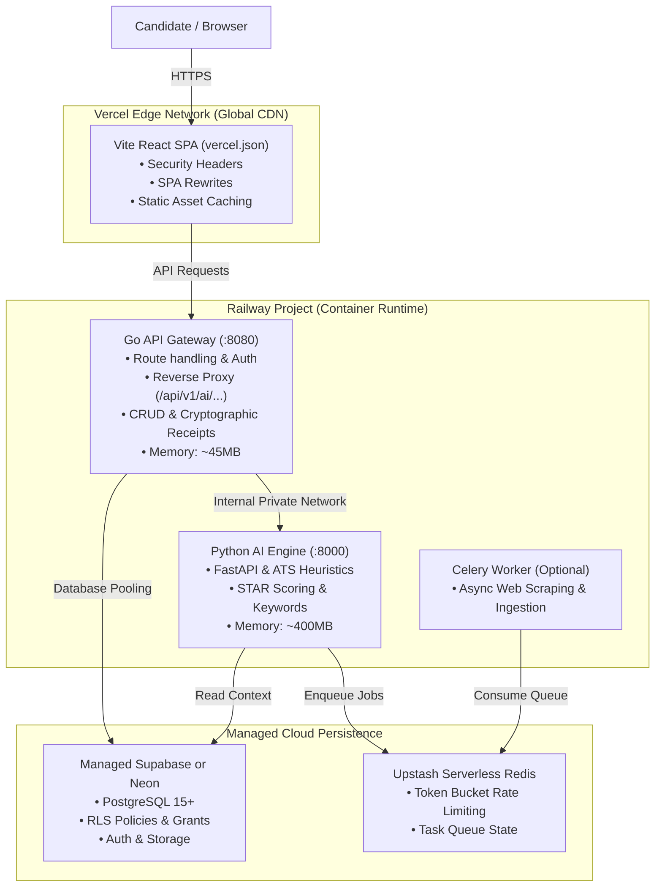

# 🚀 Lean Cloud Deployment Guide (Vercel + Railway + Supabase / Neon)

This guide documents how to deploy **Job Tayari (Tayari Skill Boost)** into production without running the resource-heavy 11-service local Docker stack (`docker-compose.yml`).

By decoupling the frontend edge, Go API gateway, Python AI engine, and database, you get **instant edge loading**, **automatic SSL**, **isolated zero-downtime deploys**, and an operating cost of **\$0–\$15/month**.

---

## 🏗 High-Level Architecture



---

## 💰 Cost & Resource Comparison

| Component | Traditional 11-Container Stack | Lean Cloud Architecture | Monthly Cost |
| :--- | :--- | :--- | :--- |
| **Frontend** | Nginx/Caddy container (64MB) | **Vercel Edge CDN** (Global caching) | **\$0 (Free Tier)** |
| **API Gateway** | Dockerized Go container (256MB) | **Railway Go Service** (`Dockerfile.backend`) | **\$2 – \$5** |
| **AI Inference** | Dockerized Python container (768MB) | **Railway Python Service** (`Dockerfile.ai`) | **\$5 – \$10** |
| **Database** | Self-hosted Postgres container (1GB) | **Managed Supabase / Neon** | **\$0 (Free Tier)** |
| **Cache & Queue** | Self-hosted Redis container (128MB) | **Upstash Serverless Redis** | **\$0 (Free Tier)** |
| **Reverse Proxy** | Caddy container (64MB) | Handled natively by Vercel & Railway | **\$0** |
| **Total Overhead** | Requires 4GB–8GB RAM dedicated VM | Serverless + Micro-containers | **~ \$7 – \$15 / month** |

---

## 📋 Environment Variables Checklist

### 1. Frontend (`Vercel`)
Set in **Vercel Dashboard → Project Settings → Environment Variables**:

```env
VITE_API_URL=https://your-go-gateway.up.railway.app
VITE_USE_SELF_HOSTED=false
VITE_SUPABASE_URL=https://your-project.supabase.co
VITE_SUPABASE_ANON_KEY=eyJhbGciOi...
```

### 2. Go API Gateway (`Railway - go-backend`)
Set in **Railway Dashboard → `go-backend` Service → Variables**:

```env
ENV=production
APP_ENV=production
PORT=8080
DATABASE_URL=postgresql://postgres:[PASSWORD]@[HOST]:[PORT]/postgres?sslmode=require
AI_SERVICE_URL=http://python-ai.railway.internal:8000
AI_INTERNAL_TOKEN=generate_a_secure_64_character_hex_token
JWT_SECRET=generate_a_secure_64_character_hex_token
SUPABASE_URL=https://your-project.supabase.co
SUPABASE_ANON_KEY=eyJhbGciOi...
SUPABASE_SERVICE_ROLE_KEY=eyJhbGciOi...
USE_SUPABASE=true
ALLOWED_ORIGINS=https://your-app.vercel.app,https://yourdomain.com
FRONTEND_URL=https://your-app.vercel.app
APP_VERSION=production-lean
```

### 3. Python AI Engine (`Railway - python-ai`)
Set in **Railway Dashboard → `python-ai` Service → Variables**:

```env
ENV=production
PORT=8000
DATABASE_URL=postgresql://postgres:[PASSWORD]@[HOST]:[PORT]/postgres?sslmode=require
REDIS_URL=rediss://default:[PASSWORD]@[HOST]:[PORT]
JWT_SECRET=same_token_as_go_gateway
AI_INTERNAL_TOKEN=same_token_as_go_gateway
APPROVAL_SIGNING_KEY=generate_secure_signing_key
TAYARI_API_KEY=generate_api_key
AUTONOMOUS_SUBMIT_ENABLED=false
GO_BACKEND_URL=http://go-backend.railway.internal:8080
OPENAI_API_KEY=sk-...
ANTHROPIC_API_KEY=sk-ant-...
```

---

## 🛠 Step-by-Step Deployment

### Step 1: Initialize Database (Supabase or Neon)
1. Create a project at [supabase.com](https://supabase.com) or [neon.tech](https://neon.tech).
2. Copy the PostgreSQL connection string (`DATABASE_URL`).
3. Apply the **Lean MVP 12-Core Schema** (recommended rapid setup):
   ```bash
   # From your development terminal:
   psql "$DATABASE_URL" -f scripts/lean-schema-12.sql
   ```
   > **Note on Schema Efficiency**: Rather than loading the sprawling 58-table development history, `scripts/lean-schema-12.sql` establishes the exact 12 production-critical tables (`profiles`, `user_roles`, `resumes`, `tailored_resumes`, `resume_analyses`, `saved_jobs`, `scraped_jobs`, `application_attempts`, `interview_sessions`, `credits`, `billing_transactions`, and `agent_runs`) with hardened Row Level Security (RLS), strict owner-scoped policies (`auth.uid() = user_id`), zero public `USING (true)` policies, and least-privilege GRANTS for `authenticated` and `service_role`.
4. Verify RLS tables and user ownership policies.

### Step 2: Deploy Go API Gateway on Railway
1. Open [railway.app](https://railway.app) and create a **New Project** → **Deploy from GitHub Repo**.
2. Name the service `go-backend`.
3. Configure the build settings:
   - **Builder**: `DOCKERFILE`
   - **Dockerfile Path**: `Dockerfile.backend`
   - **Healthcheck Path**: `/healthz`
4. Add the `go-backend` environment variables listed above.
5. Generate a public domain (e.g., `https://tayari-gateway.up.railway.app`).

### Step 3: Deploy Python AI Engine on Railway
1. In the same Railway project, click **New Service** → **GitHub Repo** (same repository).
2. Name the service `python-ai`.
3. Configure the build settings:
   - **Builder**: `DOCKERFILE`
   - **Dockerfile Path**: `Dockerfile.ai`
   - **Healthcheck Path**: `/health`
4. Add the `python-ai` environment variables.
5. (Optional) In Railway network settings, link `python-ai` so it communicates with `go-backend` privately via `railway.internal`.

### Step 4: Deploy Frontend on Vercel
1. Open [vercel.com](https://vercel.com) → **Add New Project** → Import the `tayari-skill-boost` repository.
2. Vercel will automatically read `vercel.json`:
   - Framework Preset: `Vite`
   - Build Command: `vite build`
   - Output Directory: `dist`
3. Add the `VITE_*` environment variables.
4. Click **Deploy**. Vercel will build the frontend and serve it globally with edge caching and security headers.

---

## 🔍 Verification & Health Checks

Once deployed, verify that all systems are operational:

1. **Go Gateway Liveness**:
   ```bash
   curl -i https://your-go-gateway.up.railway.app/healthz
   # Expected: HTTP/1.1 200 OK -> "ok"
   ```

2. **Python AI Liveness**:
   ```bash
   curl -i https://your-go-gateway.up.railway.app/api/v1/ai/health
   # Expected: HTTP/1.1 200 OK -> {"status": "ok"}
   ```

3. **60-Second Magic Moment ATS Test**:
   - Navigate to `https://your-app.vercel.app/`
   - Click one of the Hero presets (**Stripe**, **Cloudflare**, or **Linear**)
   - Click **Run 60s Gap Analysis**
   - Confirm immediate redirection to `/free-scan` and automated ATS score output.

4. **Security & Production Gate**:
   ```bash
   bun run security:production
   # Verifies zero unresolved critical/high security findings
   ```

---

## 🛡 Security & Best Practices
- **Strict Service Isolation**: The frontend only communicates with Go (`/api/v1/...`). The Python AI engine and Celery workers are private and never directly exposed to the public internet.
- **Autonomous Submissions Disabled**: `AUTONOMOUS_SUBMIT_ENABLED=false` is enforced server-side. Applications always require user human-in-the-loop review.
- **Durable Cryptographic Receipts**: Submissions generate verifiable SHA-256 evidence logs stored in Postgres.
