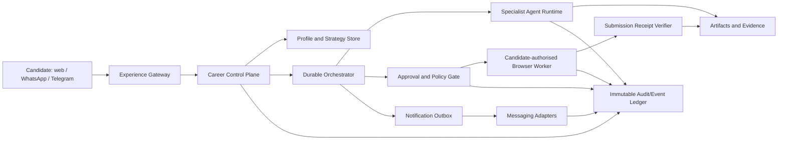

# Job Tayari: Manus-Style Career Agent and Open-Core Architecture

**Status:** Architecture decision record for implementation.
**Scope:** A trustworthy career operating system for software-engineering job seekers, not an autonomous mass-application bot.
**Decision:** Build a **closed, managed Tayari Cloud** around a deliberately useful, genuinely permissive **Tayari Protocol** open-source package. Keep all browser execution, credentials, candidate memory, policy enforcement, and managed orchestration commercial.

> **Product truth:** Job Tayari must never describe a prepared application, a candidate-confirmed click, or an unverified portal response as an externally verified submission. Every screen, message, and API must preserve that distinction.

## 1. North-star product contract

The target is a Manus-style career agent that transforms a candidate outcome into a visible plan, delegates bounded work to specialised agents, shows the current state and artefacts, pauses at meaningful consent boundaries, and delivers evidence. It is not a chat interface with decorative status updates. The public Manus materials describe task planning, sandboxed execution, persistent task context, browser operation with candidate oversight, and delivered work products; those are the transferable interaction principles for Job Tayari.[1] [2]

| Candidate promise | Required product behaviour | Release evidence |
|---|---|---|
| **“TA understands my career goal.”** | A versioned profile, target-role strategy, domain-transition plan, and user-editable assumptions feed every agent run. | Each run displays the profile and goal version used; the user can edit and rerun. |
| **“TA is doing real work.”** | Each visible activity maps to a real `run_id`, event, artefact, or connector action. | Activity timeline records source, timestamp, actor, outcome, and artefact/reference. |
| **“I remain in control.”** | The product stops for credentials, sensitive questions, application review, and external submission confirmation. | Signed/hashed approval record and revocation state are attached to the action. |
| **“The system is honest.”** | Unavailable workers or connectors render `PREVIEW`, `OFFLINE`, or `NEEDS_CANDIDATE_TAKEOVER`. | No simulated state can be labelled live or submitted. |
| **“My data is protected.”** | Browser credentials are never retained, connector access is scoped, and every connector has disconnect/delete controls. | Scope, retention, access log, and deletion job are visible in settings. |

## 2. The Tayari nervous system

The system should use a five-plane model. This adopts the useful Manus patterns—isolated workspaces, resumable work, human intervention, and observable results—while imposing job-seeking-specific execution and policy boundaries.[2] [3]

| Plane | Responsibilities | Hard boundary |
|---|---|---|
| **Experience gateway** | Web, mobile, extension, WhatsApp, Telegram, accessibility, live activity viewer, takeover controls. | Messaging can request, clarify, stop, or notify. It cannot authorise final submission. |
| **Career control plane** | Candidate tenancy, profile/goal versions, run registry, policy decisions, connector permissions, agent capability catalogue. | It cannot impersonate a portal session or directly claim portal success. |
| **Durable orchestration** | Queue, idempotent work steps, retries, scheduling, dead-letter handling, pause/resume, event outbox. | Retry never repeats a final external action without receipt reconciliation and fresh approval. |
| **Execution plane** | Narrow specialist agents, retrieval, document tooling, connector workers, isolated browser workers. | Per-candidate isolation; no shared cookies, downloaded files, or prompt context. |
| **Evidence plane** | Append-only run events, artefact hashes, approval references, delivery ledger, receipt verification, deletion ledger. | Candidate-visible truth source; state transitions are rejected if evidence is missing. |

### Core state machines

Every operation uses an explicit state machine. The product currently has pieces of this approach; this must become the cross-service contract, including the UI, Go API, Python agent runtime, messaging adapters, and browser worker.

| Object | Allowed states | Non-negotiable transition rule |
|---|---|---|
| **Career run** | `DRAFT → PLANNED → RUNNING → WAITING_FOR_CANDIDATE → COMPLETED / CANCELLED / FAILED` | `RUNNING` must have a real worker/agent event stream. |
| **Application** | `DISCOVERED → QUALIFIED → PREPARED → REVIEW_REQUIRED → APPROVED_FOR_DRAFT → DRAFT_FILLED → CANDIDATE_CONFIRMED → EXTERNALLY_VERIFIED` | Only receipt verification may create `EXTERNALLY_VERIFIED`. |
| **Approval** | `REQUESTED → APPROVED / DENIED / EXPIRED / REVOKED` | Approval binds candidate ID, artefact hash, portal/action, expiry, and policy version. |
| **Connector** | `UNLINKED → PENDING_LINK → ACTIVE → DEGRADED → REVOKED → DELETION_PENDING` | Scopes, retention period, and last successful sync are user visible. |
| **Message delivery** | `QUEUED → SENT → ACKNOWLEDGED / AMBIGUOUS / FAILED` | Ambiguous delivery is visibly ambiguous and does not silently become success. |

## 3. Multi-agent design: TA as an accountable coordinator

TA is the candidate-facing coordinator, not an unbounded general-purpose agent. It starts every action by creating a plan and delegates only to registered specialist capabilities. The existing Job Tayari optimizer and truth-gate squad should become the first governed workflow, then expand through narrow, independently testable agents.

| Agent | Input contract | Allowed output | Forbidden action |
|---|---|---|---|
| **Career strategist** | Profile version, target-role plan, market signal set | Prioritised weekly plan with assumptions and sources | Inventing qualifications or silently changing a career goal |
| **Job discovery agent** | Allowlisted sources, search policy, role/candidate constraints | Normalised job cards and source references | Scraping or applying where policy forbids it |
| **Fit and truth agent** | Candidate evidence, JD, employer facts | Explainable fit/risk assessment and missing-evidence list | Fabricating skills, metrics, employers, or citations |
| **Document agent** | Resume/case-study version, approved JD, writing instruction | Versioned tailored artefact and diff | Altering facts outside candidate-approved source evidence |
| **Question agent** | Portal form schema, candidate answer bank | Clarification questions and reusable answer suggestions | Answering protected, legal, or ambiguous questions without candidate input |
| **Browser draft agent** | Narrow worker lease, approved artefact hash, portal policy | Observed steps, draft-fill status, screenshots/evidence refs | Final submission, CAPTCHA bypass, hidden application, or credential retention |
| **Receipt verifier** | Portal response evidence and worker trace | `EXTERNALLY_VERIFIED`, `AMBIGUOUS`, or `NOT_VERIFIED` | Assuming a success response is a receipt |

The orchestrator must use a **least-privilege capability manifest**: agents obtain a task-scoped capability token, a candidate/tenant ID, a policy version, and an expiry. It must record a compact event summary and hashes, not raw resumes, messages, or secrets. The Hermes gateway’s per-session isolation, explicit `/stop`, approval/deny controls, and durable delivery ledger are valuable inspirations for this operational model.[4] [5]

## 4. Messaging: WhatsApp and Telegram without unsafe delegation

Messaging is a companion surface for daily plans, delayed-review reminders, status updates, and lightweight clarification. It is not a substitute for the web approval centre. Hermes documents a useful adapter/session model, per-channel session separation, allowlists, and delivery semantics; it also documents the practical account-risk difference between unofficial WhatsApp Web automation and the official WhatsApp Business Cloud API.[5] [6] [7]

| Channel | Phase 1 use | Identity and security | Explicit restriction |
|---|---|---|---|
| **Telegram** | Opt-in status notifications, task summaries, “open review” deep links, `/stop` and `/status`. | OAuth/web account link plus Telegram user-ID allowlist, signed webhook secret, per-user channel session. | No approval or sensitive-answer capture in chat. |
| **WhatsApp** | Opt-in high-priority reminders and daily/weekly progress digests. | Meta official Business Cloud API, dedicated business number, approved templates where required, verified webhook signatures, account-link confirmation. | Do not use WhatsApp Web/Baileys in production; no bulk unsolicited messaging; no final submission approval in chat. |
| **Email/Gmail** | Existing interview signal ingestion, status digests, candidate initiated follow-ups. | Read-only scope minimised by query/window; encrypted token; disconnect/delete control. | Do not process unrelated mailbox content or infer consent from mailbox access. |
| **Web control room** | Plans, agent traces, artefact review, policy warnings, browser takeover, sensitive questions, approvals, receipts. | Authenticated, candidate-scoped, passkey/session protection, approval hash and expiry. | This is the only final confirmation surface. |

## 5. Open-core commercialisation decision

A true open-core product gives developers and candidates useful portable tools while reserving the managed trust and operation layer. Confluent’s public materials distinguish permissive Apache-licensed components from source-available code that is not OSI open source; do not call Job Tayari “open source” if the code is merely source-available.[8] [9] Supermemory’s local-versus-enterprise model suggests a more appropriate division: a shared API/protocol with commercial value in managed controls, roles, observability, quality, scale, and support.[10]

| Open source: **Tayari Protocol** | Closed source: **Tayari Cloud** | Why the boundary is defensible |
|---|---|---|
| MIT-licensed schema package: `CandidateReference`, `CareerGoal`, `JobPosting`, `CareerRun`, `WorkerLease`, `Approval`, `ApplicationReceipt`, and event-envelope types. | Candidate identity vault, profile graph, longitudinal memory, encryption/key management. | Candidate portability can be open; identity, encrypted data, and hosted reliability are the commercial service. |
| Consent/application and run-lifecycle state-machine specification, cancellation rules, exact worker-lease checks, and conformance fixtures. | Policy registry, policy authoring, risk detection, anti-abuse controls, durable outbox, worker leasing, and receipt reconciliation. | The protocol should be interoperable; managed enforcement and legal/policy operations create trust. |
| Local career journal CLI, job-description normaliser, citation/receipt verifier libraries, and a simulator that stops before external submission. | Isolated browser-worker fleet, provider/portal adapters, credential handoff, screenshot storage, session leasing, and worker observability. | The difficult value is safe, managed execution—not an unchecked public automation script. |
| Adapter SDK interfaces with mock Telegram/WhatsApp transports and test harness. | Hosted WhatsApp/Telegram adapters, account linking, delivery ledger, notification preferences, rate limits, templates, and support. | Open interfaces accelerate ecosystem adoption; hosted regulated operation remains commercial. |
| Evaluation datasets with synthetic/no-PII fixtures and CI conformance tooling. | Proprietary matching/ranking, candidate feedback loop, workflow analytics, billing, RBAC, SSO, compliance console, and enterprise support. | Evaluation standards build credibility while data network effects and operations remain defensible. |

**Repository split.** Extract `open-core/tayari-protocol` into a standalone repository with the included provisional MIT licence, separate CI, clear contribution policy, and synthetic fixtures only. Preserve compatibility through semantic versioning and a public changelog. Keep `tayari-skill-boost` private; it imports a pinned published version of the protocol package. Do not publish browser adapters, connector implementations, portal policies, secret formats, operational runbooks, or candidate data migrations.

## 6. TA assistant experience: what changes now

TA needs to be visible as a stable, high-trust product element, not only a bottom-right floating button. On desktop, the authenticated shell should expose a persistent **Tayari AI** entry in the top bar with a small `Career co-pilot` label; the mobile floating launcher remains for reachability. The action sheet must navigate to actual supported screens, never close silently after a decorative click. It must disclose that it prepares and routes work, while applications remain candidate-reviewed and receipt-verified.

| UX rule | Implementation decision |
|---|---|
| Persistent desktop visibility | Render a header CTA in `AppShell`, while keeping a compact mobile floating launcher. |
| No fake agent action | Each suggested TA action routes to a live screen and carries an `assistant` intent parameter. |
| Trust before automation | The assistant sheet states its current role, privacy boundary, and submission limit; it provides a visible `View agent work` route. |
| Accessibility | Use a labelled button, keyboard navigation, focus-managed sheet, visible focus state, and no hover-only information. |
| Progressive depth | Header CTA → quick context actions → `/agents` live task/evidence view → control room/browser takeover where actually active. |

## 7. 90-day release gates

The next 90 days should prove capability in gated increments, not attempt every integration at once. A score of 10/10 is only earned after the evidence gates are met.

| Time window | Deliverable | Gate to proceed |
|---|---|---|
| **0–30 days** | Unified run/event contract, truthful TA header, review centre, policy evaluator, artifact-hash approval, strict state machine across all services. | 100% of rendered activity traces to a stored event; no UI path can label an item applied without verified receipt evidence. |
| **31–60 days** | Isolated browser-worker proof of concept for one allowlisted ATS, candidate takeover, receipt verifier, durable outbox, Telegram opt-in notifications. | Tenant-isolation, cancellation, retry/idempotency, takeover, and ambiguous-receipt tests pass; no stored portal passwords/cookies. |
| **61–90 days** | WhatsApp Business Cloud API opt-in, Gmail minimisation controls, scheduled job monitor, open-source Tayari Protocol v0.1, private enterprise policy console. | Security review, provider compliance review, deletion and revocation drills, external usability test, load/recovery test, and legal licence review complete. |

## 8. Ruthless questions before calling the product 10/10

1. Can an independent auditor reconcile every “applied” card to a portal receipt, timestamp, portal identity, and worker trace?
2. If a browser worker is compromised, can it read another candidate’s files, cookies, or prompts?
3. Can a candidate revoke an approval or connector permission and prove it stopped downstream work?
4. What happens when a portal changes its form, blocks automation, returns an ambiguous response, or requests a CAPTCHA?
5. Which career recommendations are facts, which are model inferences, and which have a cited source?
6. Can a candidate export and permanently delete their profile, job history, documents, messages, and connector data without support intervention?
7. What is the candidate-visible difference between a job **found**, **qualified**, **prepared**, **draft filled**, **candidate confirmed**, and **externally verified**?
8. Do automation and messaging policies respect job-board terms, anti-spam obligations, and channel-specific provider rules?
9. Are WhatsApp/Telegram notifications opt-in, rate limited, identity-linked, and safely stoppable in one action?
10. Is the open-source package useful enough to earn adoption without exposing portal policies, browser-worker operations, or candidate data?
11. Can the commercial service defend its price through trust, managed execution, unique data quality, and support—not dark patterns or lock-in?
12. Have candidates from different seniority, geography, accessibility needs, and career-transition paths completed the core workflow successfully?
13. Is every agent capability narrow, permissioned, observable, and independently evaluated?
14. Can support diagnose a failed run without inspecting raw sensitive candidate data by default?
15. Would the team confidently show the event trail and application evidence to the candidate, employer, and regulator?

## References

[1] [Manus Documentation: Welcome](https://manus.im/docs/introduction/welcome)
[2] [Manus Browser Operator](https://manus.im/features/manus-browser-operator)
[3] [E2B: How Manus uses E2B to provide agents with virtual computers](https://e2b.dev/blog/how-manus-uses-e2b-to-provide-agents-with-virtual-computers)
[4] [Hermes Agent repository](https://github.com/NousResearch/hermes-agent)
[5] [Hermes Messaging Gateway](https://github.com/NousResearch/hermes-agent/blob/main/website/docs/user-guide/messaging/index.md)
[6] [Hermes Telegram setup](https://github.com/NousResearch/hermes-agent/blob/main/website/docs/user-guide/messaging/telegram.md)
[7] [Hermes WhatsApp setup](https://github.com/NousResearch/hermes-agent/blob/main/website/docs/user-guide/messaging/whatsapp.md)
[8] [Confluent Community License FAQ](https://www.confluent.io/confluent-community-license-faq/)
[9] [Confluent licensing rationale](https://www.confluent.io/blog/license-changes-confluent-platform/)
[10] [Supermemory: Local vs Enterprise](https://supermemory.ai/docs/self-hosting/local-vs-enterprise)
