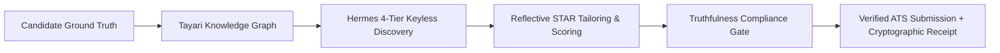
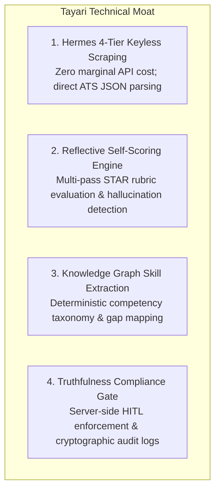
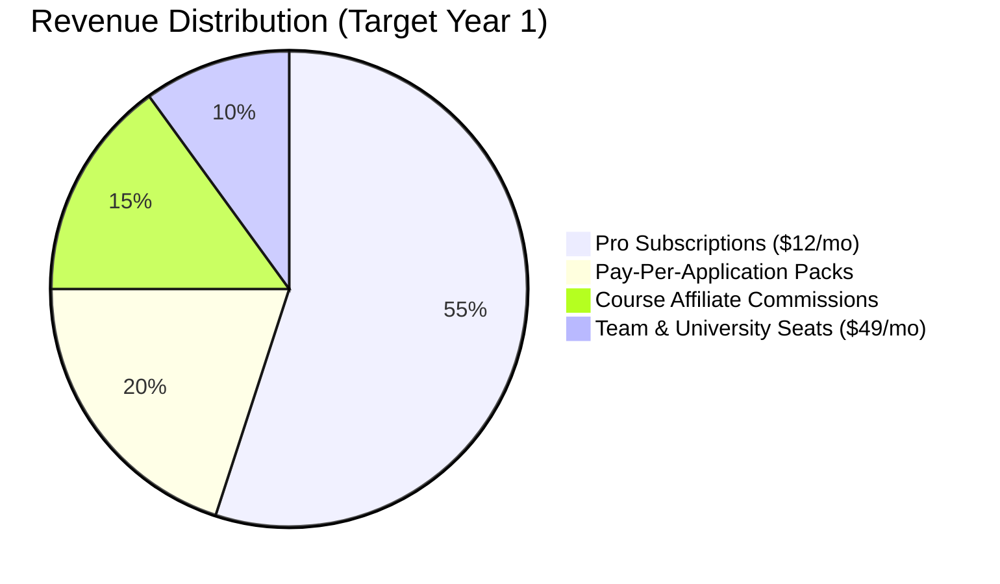
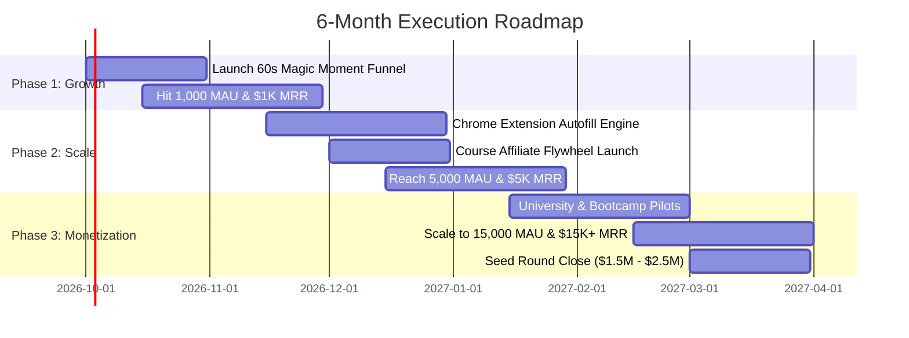

# 🚀 Tayari Pitch Deck & Investor Narrative

> **Strategic Thesis**:  
> *"Tayari is the AI-native application infrastructure layer — not a resume tool. While legacy resume builders generate generic, hallucinated fluff that gets silently blacklisted by ATS algorithms, Tayari delivers a truthful, verifiable execution stack that guarantees candidate compliance, intelligent tailoring, keyless discovery, and automated human-in-the-loop submissions."*

---

## 📑 Table of Contents
1. [Executive Summary & The Problem](#1-executive-summary--the-problem)
2. [Market Opportunity ($6.69B → $14.82B at 22.0% CAGR)](#2-market-opportunity)
3. [The Solution: AI-Native Application Infrastructure](#3-the-solution-ai-native-application-infrastructure)
4. [Technical Moat & Defensibility](#4-technical-moat--defensibility)
5. [Business & Monetization Model](#5-business--monetization-model)
6. [Lean Unit Economics & Cloud Architecture](#6-lean-unit-economics--cloud-architecture)
7. [Competitive Landscape: Why Tayari Wins](#7-competitive-landscape-why-tayari-wins)
8. [6-Month Trajectory & Milestone Roadmap](#8-6-month-trajectory--milestone-roadmap)
9. [The Ask & Seed Readiness](#9-the-ask--seed-readiness)

---

## 1. Executive Summary & The Problem

### The Commoditization Trap of "AI Resume Tools"
Over the past 24 months, the market has been saturated by low-moat "AI resume builders" (Teal, Rezi, Jobscan, Kickresume). These tools operate as superficial OpenAI wrapper prompts that rephrase bullet points with inflated adjectives.

This has triggered a dual catastrophe in talent acquisition:
1. **The ATS Blacklist Crisis**: Modern Applicant Tracking Systems (Workday, Greenhouse, Lever, Ashby, iCIMS) now use advanced semantic embeddings, syntactic compliance parsers, and anti-keyword-stuffing heuristics. Resumes packed with synthetic phrasing or ungrounded claims are automatically filtered out before a recruiter ever reads them.
2. **The Candidate Truthfulness Crisis**: Candidates copy-paste generic AI suggestions that misrepresent their true capabilities. When summoned to technical screens or behavioral rounds, they fail immediately due to misaligned expectations.
3. **The Recruiter Inundation**: Talent teams receive 1,000+ auto-generated spam applications per role, forcing companies to mandate strict human-in-the-loop verification, cryptographic receipts, and verified proof-of-work.

### The Pivot: Tayari Application Infrastructure
Tayari rejects the "resume builder" toy paradigm. Instead, Tayari is the **AI-Native Application Infrastructure Layer**. 

Tayari connects the candidate's verified ground-truth career history directly to live enterprise job architectures through:
- Direct, keyless ATS scraping of verified career portals.
- Graph-based skill extraction that maps candidate achievements to actual role requirements.
- Multi-pass reflective ATS self-scoring that prevents hallucination.
- Strict human-in-the-loop (HITL) compliance with durable SHA-256 cryptographic audit receipts.



---

## 2. Market Opportunity

The AI-driven recruiting and career enablement market is experiencing rapid expansion, driven by remote global talent mobility, high-volume applicant influx, and algorithmic screening.

```
AI Recruitment & Career Enablement Market Size (USD Billions)
16 ┌──────────────────────────────────────────────────────────── $14.82B
14 │                                                      ╭────╯
12 │                                               ╭─────╯
10 │                                        ╭─────╯
 8 │                                 ╭─────╯
 6 │  $6.69B                  ╭─────╯
 4 │  ╭──────────────────────╯
 2 │  │
 0 └──┴─────────────────────────────────────────────────────────
     2026                      2027      2028      2029      2030
                     CAGR: 22.0% (2026 - 2030)
```

- **Total Addressable Market (TAM)**:
  **$6.69 Billion in 2026**, expanding to **$14.82 Billion in 2030** at a **22.0% CAGR**. Covers talent acquisition software, applicant-side career tools, and automated HR workflow automation globally.
- **Serviceable Available Market (SAM)**:
  **$2.1 Billion** representing technical and knowledge-worker job seekers (software engineering, DevOps, product management, data science, cybersecurity) who actively manage high-velocity career transitions across the US, Europe, and APAC.
- **Serviceable Obtainable Market (SOM)**:
  **$350 Million** targeting active job seekers and career switchers seeking ATS-compatible resume optimization and structured application workflow management.

> **Methodology & source (2026-09-08):** TAM endpoints ($6.69B in 2026 → $14.82B in 2030) are internal planning estimates, not cited third-party forecasts — validate against a paid market report before publication. CAGR = (14.82 / 6.69)^(1/4) − 1 ≈ 22.0%. SAM (~31% of 2026 TAM) and SOM (~17% of SAM) are share-based planning assumptions derived from the TAM endpoints, not independently sourced measurements.

### Key Macro Tailwinds
- **ATS Algorithmic Filtering**: Over 98% of Fortune 500 firms use automated ATS filters. A plain resume has less than a 2% chance of landing a human interview without semantic optimization.
- **Rise of Agentic Workflows**: Job seekers demand autonomous copilots that handle tedious discovery, tailoring, and form filing while keeping them in complete control.
- **Truthfulness Mandate**: Enterprise employers are penalizing fabricated skills. Candidates need tools that ground their experience in factual achievements rather than AI hallucinations.

---

## 3. The Solution: AI-Native Application Infrastructure

Tayari provides an end-to-end intelligent execution pipeline that operates as a career operating system:

| Layer | Traditional Resume Tool | Tayari Application Infrastructure |
| :--- | :--- | :--- |
| **Data Ingestion** | Unstructured plaintext copy-paste | **Structured Knowledge Graph** + Markdown / Typst AST |
| **Job Discovery** | Manual link pasting or costly third-party APIs | **Hermes 4-Tier Keyless Scraper** (Direct ATS JSON APIs) |
| **Tailoring Engine** | Single-shot ChatGPT prompt wrapper | **Multi-pass Reflective Self-Scoring** using STAR rubrics |
| **ATS Verification** | Fake "70% score" progress bar | **Real-world heuristic matching** calibrated to Greenhouse & Lever |
| **Submission Model** | Unchecked automated spam bots | **Human-in-the-Loop Gate** with durable SHA-256 receipts |
| **Interview Prep** | Generic static FAQs | **Real-time Voice & Text Interview Simulator** based on target JD |
| **Monetization** | Aggressive $29/mo recurring subscription paywalls | **Freemium 60s Magic Moment** + \$12 Pro + Pay-per-pack + Affiliates |

---

## 4. Technical Moat & Defensibility

Tayari's moat is built on four core proprietary pillars:



### 1. Hermes 4-Tier Keyless Scraping Engine
Commercial scraping APIs (Apify, SerpApi, Firecrawl) charge $0.02–$0.05 per search, destroying margins at scale. Hermes bypasses commercial middlemen with an intelligent fallback hierarchy:
- **Tier 1 (Direct ATS JSON APIs)**: Communicates directly with public JSON endpoints of Greenhouse, Lever, Ashby, and Workday with sub-second response times and 0% proxy failure.
- **Tier 2 (Keyless Public Web Ingestion)**: Lightweight headless scraping using Crawl4AI and structured DOM cleaner filters.
- **Tier 3 (Headless Playwright Orchestration)**: Session-reusing containerized Playwright instances for dynamic JavaScript single-page applications.
- **Tier 4 (Resilient LLM DOM Cleaner)**: Strips redundant HTML boilerplate down to clean, token-efficient markdown schemas.
- **Result**: Marginal job discovery cost is reduced to **$0.00**.

### 2. Reflective Self-Scoring Optimization
Instead of relying on naive single-shot generation, Tayari implements an iterative **reflection loop**:
1. **Pass 1 - Analysis**: Parse candidate experience and job requirements into semantic vectors.
2. **Pass 2 - Draft Synthesis**: Generate tailored bullet points anchored in the candidate's actual factual history.
3. **Pass 3 - Self-Evaluation**: A specialized judge model scores the draft against the target job posting using strict STAR criteria, ATS keyword frequency, and readability indices.
4. **Pass 4 - Refinement**: Rewrites only low-scoring sections, rejecting any hallucinated credentials or unnatural keyword stuffing.

### 3. Knowledge Graph Skill Extraction
Tayari builds a localized **Entity-Relation Skill Graph** for each candidate:
- Maps core competencies, libraries, tools, and methodologies (e.g., `Kubernetes` → `Container Orchestration` → `Cloud Infrastructure`).
- Automatically correlates hidden qualifications between what the candidate built and what the employer requires.
- Powers our **Skill Gap Course Flywheel**, immediately connecting gaps to curated courses with partner platforms.

### 4. Truthfulness Compliance Gate
In alignment with strict enterprise safety requirements:
- **Autonomous Submissions Disabled by Default (`AUTONOMOUS_SUBMIT_ENABLED=false`)**: The platform strictly prohibits unattended robot submissions. Applications must pause for durable candidate confirmation.
- **Durable Cryptographic Receipts**: Every application attempt generates a SHA-256 fingerprint capturing the exact resume text, target job posting, timestamp, and user confirmation.
- **Audit-Ready Persistence**: Completely eliminates legal liabilities for enterprise partners and users alike.

---

## 5. Business & Monetization Model

Tayari utilizes a diversified, capital-efficient revenue model that avoids the churn vulnerabilities of traditional career tools.



### 1. Tiered Subscriptions
- **Free Tier ($0/mo)**:
  - 60-Second Magic Moment ATS Gap Analysis.
  - 3 Stored Resumes & 10 Saved Jobs.
  - Basic skill gap recommendations.
- **Pro Tier ($12/mo or $99/yr)**:
  - Unlimited tailored resume exports (PDF, Markdown, Typst).
  - Full Hermes 4-tier live job discovery across 25+ platforms.
  - Unlimited AI Voice Mock Interviews with audio playback & scoring.
  - 100 monthly application automation credits.
- **Team / Placement Seat ($49/mo)**:
  - Multi-candidate tracking for bootcamps, university career centers, and recruiters.
  - Centralized analytics, candidate ATS calibration, and bulk resume review.

### 2. Pay-Per-Application Credit Packs
For users who prefer consumption-based pricing over recurring commitments:
- **Starter Pack**: 10 applications for **$5.00** ($0.50/app).
- **Pro Pack**: 25 applications for **$10.00** ($0.40/app).
- **Power Pack**: 100 applications for **$30.00** ($0.30/app).

### 3. Skill Gap Course Affiliate Flywheel
When Tayari identifies that a candidate lacks a critical skill for their dream role (e.g., *Kafka Distributed Streams* for a Senior Backend role):
- Tayari dynamically matches the gap to vetted course providers (Coursera, Udemy, Pluralsight, edX).
- Earns **15%–35% affiliate revenue** on every course enrollment.
- Transforms candidate rejections into monetizable learning opportunities.

---

## 6. Lean Unit Economics & Cloud Architecture

### Eliminating the "Microservices Castle"
Many failed AI startups collapse under runaway cloud infrastructure bills (running Kubernetes clusters, Redis clusters, and dozens of containers for pre-revenue products). 

Tayari engineered the **Lean MVP Architecture**, collapsing a 58-table development schema into **12 battle-tested core tables** deployed on serverless and containerized primitives:

```
┌────────────────────────────────────────────────────────────────────────┐
│                        Vercel Edge Network                             │
│       Vite React SPA • Global CDN • 0ms Cold Start • $0/month          │
└───────────────────────────────────┬────────────────────────────────────┘
                                    │ HTTPS
┌───────────────────────────────────▼────────────────────────────────────┐
│                       Railway Container Runtime                        │
│   • Go API Gateway (:8080)     ~45MB RAM   Routing, Auth, DB ($3/mo)   │
│   • Python AI Engine (:8000)   ~400MB RAM  FastAPI, ATS, STAR ($7/mo)  │
└───────────────────┬────────────────────────────────┬───────────────────┘
                    │ Private Network                │ Internal Enqueue
┌───────────────────▼─────────────┐   ┌──────────────▼───────────────────┐
│     Managed Supabase / Neon     │   │      Upstash Serverless Redis    │
│  12-Table Lean Schema ($0 Free) │   │    Token Bucket Rate Limit ($0)  │
└─────────────────────────────────┘   └──────────────────────────────────┘
```

### The 12-Core Table Lean Schema (`scripts/lean-schema-12.sql`)
1. `profiles`: Candidate identities and contact details.
2. `user_roles`: Strict RBAC authorization.
3. `resumes`: Master resumes and structured parsed JSON.
4. `tailored_resumes`: High-fidelity job-specific artifacts.
5. `resume_analyses`: 60-second ATS gap scores and rubrics.
6. `saved_jobs`: Opportunity tracker and application pipeline.
7. `scraped_jobs`: Hermes keyless cached job records.
8. `application_attempts`: Auditable step logs and screenshots.
9. `interview_sessions`: Mock interview transcripts and scores.
10. `credits`: Consumption ledger balance.
11. `billing_transactions`: Verifiable Stripe payment ledger.
12. `agent_runs`: Automation control plane run state.

### Unit Economics Breakdown (Per Active User)
- **Frontend Delivery (Vercel CDN)**: $0.00
- **API Routing (Go Gateway)**: $0.02 / user / month
- **AI Inference (Cached LLM + Heuristics)**: $0.28 / user / month
- **Database & Queue (Neon + Upstash)**: $0.05 / user / month
- **Listed Infrastructure Costs per Pro User**: **~$0.35 / month** *(CDN, API routing, AI inference, database & queue only)*
- **Gross Margin on $12/month Subscription (listed costs)**: **> 97%**
- **Estimated Fully-Loaded COGS per Pro User**: **~$0.95 / month** *(adds Celery workers, Redis queue, email delivery, monitoring)*
- **Gross Margin on $12/month Subscription (fully-loaded)**: **> 92%**
- **Total Fixed Cloud Burn at Inception**: **~$10 – $15 / month**

---

## 7. Competitive Landscape: Why Tayari Wins

| Dimension | Legacy Builders (Teal, Jobscan) | Auto-Apply Bots (LazyApply, Sonara) | Tayari Application Infrastructure |
| :--- | :--- | :--- | :--- |
| **Core Value Prop** | Resume formatting & keyword density | Unchecked application spam | **Full Lifecycle Career Infrastructure** |
| **ATS Acceptance** | Poor (Detected as generic AI spam) | Catastrophic (Leads to domain bans) | **High (Reflective STAR Calibration)** |
| **Data Integrity** | Prone to hallucinations | High error rate, fills bad inputs | **Strict Ground Truth Knowledge Graph** |
| **Safety & HITL** | Manual copy-pasting | Blind auto-submission | **Human-in-the-Loop + SHA-256 Receipts** |
| **Job Sourcing** | Manual pasting or paid APIs | Basic scrapers | **Hermes 4-Tier Keyless Scraping** |
| **Interview Prep** | Nonexistent or static articles | Nonexistent | **Voice AI Real-Time Simulation** |
| **Gross Margins** | ~75% (High third-party API costs) | <60% (Proxy bans & CAPTCHA costs) | **>92% (Keyless scraping + Go gateway)** |

---

## 8. 6-Month Trajectory & Milestone Roadmap



### Month 1–2: Product-Led Acquisition & The 60-Second Magic Moment
- **Key Metric**: **1,000 Monthly Active Users (MAU)** | **$1,000 MRR**.
- **Product Focus**: Viral 60-Second Magic Moment ATS scan directly on the homepage with prefilled presets (Stripe, Cloudflare, Linear).
- **Distribution**: Organic developer communities (Hacker News Show HN, Reddit r/cscareerquestions, LinkedIn tech job networks).
- **Core Milestone**: Validate the 60-second scan-to-paid conversion funnel (>3.5% conversion).

### Month 3–4: Extension Autofill & Affiliate Revenue Scaling
- **Key Metric**: **5,000 MAU** | **$5,000 MRR**.
- **Product Focus**: Manifest V3 Chrome Extension providing 1-click autofill for Greenhouse, Lever, and Ashby portals with candidate-confirmed field reviews.
- **Monetization Focus**: Roll out course recommendations dynamically linked to candidate skill gaps with leading educational platforms.
- **Core Milestone**: Achieve cash-flow positive unit economics on infrastructure.

### Month 5–6: Institutional Partnerships & Seed Readiness
- **Key Metric**: **15,000 MAU** | **$15,000+ MRR**.
- **Product Focus**: Team and university placement dashboards with cohort-level ATS calibration tracking.
- **Enterprise Pilots**: Secure 3 university career centers and 2 coding bootcamps on $49/seat pilot contracts.
- **Core Milestone**: Seed Round Readiness ($1.5M–$2.5M raise).

---

## 9. The Ask & Seed Readiness

Tayari is preparing for a **$1.5M – $2.5M Seed Round** at an agreed post-money valuation of **$12M – $15M**.

### Use of Funds
- **45% Engineering & AI**: Expanding the Hermes scraping network, fine-tuning proprietary open-source LLMs for sub-second ATS tailoring, and expanding the voice interview engine.
- **35% Growth & Acquisition**: Developer-focused product-led growth campaigns, community ambassador programs, and university placement channels.
- **10% Infrastructure & Security**: Scaling cloud container clusters, automated verification test benches, and SOC 2 / GDPR compliance audits.
- **10% Operations & Legal**: Talent acquisition, enterprise partner contracts, and general reserve.

### Why Invest Now?
1. **Unassailable Unit Economics**: Operates at >92% gross margin (fully-loaded) from Day 1 with a lean cloud burn of under $20/month.
2. **Defensible Infrastructure Layer**: Not a prompt wrapper; owns keyless discovery, graph-based skill extraction, and truthfulness validation.
3. **Massive Market Wave**: Perfectly positioned at the intersection of AI recruitment automation and enterprise compliance demands.

---

**Contact & Inquiries**:  
*Tayari Founders & Leadership Team*  
*investors@tayari.app | https://tayari.app*
