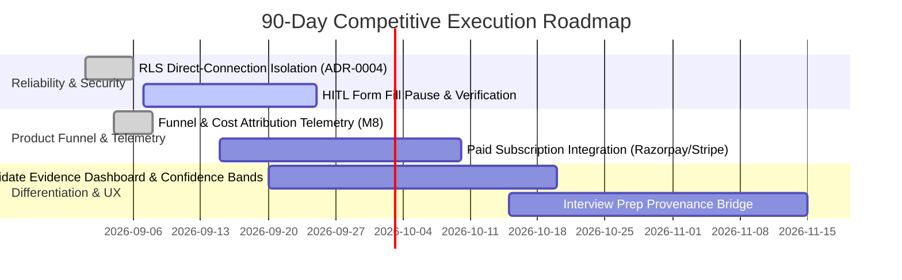

# 90-Day Competitor Scorecard: Tayari Skill Boost vs. nxtjob.ai & jobstep.io

**Evaluation Date:** 2026-09-05  
**Review Period:** Q3–Q4 2026 (90-Day Operational Benchmark)  
**Status:** Living Strategy & Execution Scorecard  

---

## 1. Executive Summary & Philosophy

Most commercial job search tools treat job seeking as an autonomous spray-and-pray funnel or an opaque “agent theater” (e.g. 9 distinct named marketing agents). In contrast, **Tayari Skill Boost** prioritizes:
1. **Verifiable Truth & Provenance**: Evidence-backed match scoring, anti-stuffing penalties, and real submission receipts.
2. **Ruthless Human-in-the-Loop (HITL) Security**: Autonomous submission defaults to `false`. Sensitive fields (EEO, salary, citizenship, work authorization) require owner confirmation.
3. **Local-First & Cost Transparency**: Self-hosted Docker / Ollama mode with clear attribution of per-workflow compute/token costs.

---

## 2. 90-Day Competitive Feature Matrix

| Feature / Dimension | nxtjob.ai (Observed / Claimed) | jobstep.io (Observed / Claimed) | Tayari Skill Boost (Target & Current State) |
| :--- | :--- | :--- | :--- |
| **Target Audience** | Senior executives (10+ yrs exp, $150k+ target) | Mid/early-career seekers & general professionals | Pragmatic software & tech talent seeking truthful evaluation |
| **Core Value Proposition** | Hidden market access, executive decision-maker outreach | Low-friction 4-step funnel: score, match, tailor, track | Observable, evidence-backed resume-to-interview chain |
| **ATS Scoring Mechanism** | Opaque proprietary AI scoring | Keyword-match single-score (percentage) | Composite score with confidence bands, semantic fit, and anti-stuffing penalty |
| **Verbatim JD Stuffing Detection** | None reported | None reported | Native 4-shingle rolling verbatim repetition detector with score damping |
| **Document Tailoring** | AI Resume rewrite | Section-by-section template fill | Typst-compiled deterministic PDF generation, zero PII export |
| **Application Automation** | "Hunter" agent automated submissions | Semi-automated browser extension / auto-fill | Browser agent with explicit HITL pause on legal, salary, & authorization fields |
| **Submission Verification** | Unverified status tag in dashboard | Confirmation screen scrape / status toggle | Cryptographically bound approval token + verifiable receipt / confirmation screenshot |
| **Interview Preparation** | "Interviewer" agent audio practice | Basic Q&A prep suggestions | Provenance-linked prep carrying exact tailored resume & JD facts into practice |
| **Data Privacy & Self-Hosting** | Hosted SaaS (closed cloud) | Hosted SaaS (GDPR / Swiss hosting claimed) | True local-first: self-hosted Docker, local Ollama LLM, zero telemetry leaks |

---

## 3. Monetization & Pricing Benchmark

| Attribute | nxtjob.ai | jobstep.io | Tayari Skill Boost (M8 Architecture) |
| :--- | :--- | :--- | :--- |
| **Entry Point** | Free evaluation / limited preview | Free tier / free score preview | Generous free tier with transparent token caps |
| **Pro / Core Tier** | ₹15,000 / month (~$180 USD) | Free trial / subscription model | Transparent monthly subscription ($15–$25 USD / ₹1,200–₹2,000 INR) |
| **Executive / Signature** | Custom coaching packages (high-ticket) | N/A | Dedicated high-volume tailoring & interview simulations |
| **Refund Policy** | Explicitly non-refundable | Standard SaaS terms | Clear prorated refund terms with zero dark patterns |
| **Cost Attribution** | Hidden inside flat margins | Hidden | Tracked via `workflow_cost_attributed` product telemetry events |

---

## 4. Evidence Quality & Approval Boundary Comparison

| Dimension | Competitor Norms (nxtjob / jobstep) | Tayari Skill Boost Standard |
| :--- | :--- | :--- |
| **Approval Boundaries** | Often backgrounded or automated to inflate "applications sent" metrics | Mandatory owner-scoped single-use approval token. Automated submit defaults to `false` |
| **Sensitive Field Governance** | Automated heuristic fills for diversity/salary questions | Immediate pause; durable handoff created for user confirmation |
| **Score Authenticity** | High scores artificially awarded to drive conversion | Calibrated scores with explicit penalties for hallucinations or missing credentials |
| **Browser Execution** | Remote headless cloud execution without live kill-switch | Local/remote browser with deterministic server-side termination and live stop control |

---

## 5. 90-Day Execution Roadmap & Milestones

### Key Milestones:
- **Month 1 (Days 1–30): Foundation & Truthful Core**
  - Finalize transaction-level tenant isolation across direct database pools.
  - Enforce verbatim JD shingle checking and anti-stuffing scoring across all ATS flows.
  - Deploy bounded product telemetry (`paid_checkout_started`, `paid_subscription_activated`, `workflow_cost_attributed`).
- **Month 2 (Days 31–60): Candidate-Controlled Workflow**
  - Implement durable human-in-the-loop review screens for form automation.
  - Launch live browser worker cancellation with sub-second real resource termination.
  - Launch paid checkout flow with fair, prorated terms.
- **Month 3 (Days 61–90): Enterprise-Grade Trust & Market Expansion**
  - Roll out verified submission receipt capture (storing application screenshot & confirmation metadata).
  - Conduct synthetic and opt-in cohort studies benchmarking real interview callback rates vs competitor averages.
  - Finalize self-hosted packaged distribution for privacy-first developers.
