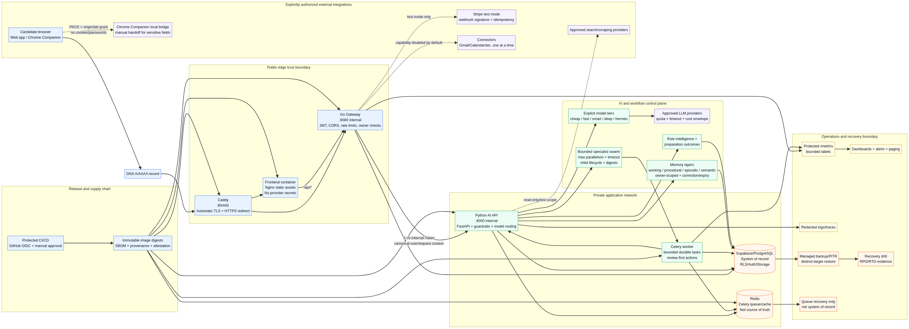

# Tayari Production Deployment Setup Guide

**Document status:** Repository-grounded operator guide
**Deployment profile:** AWS EC2 Docker Compose canary with external Supabase/PostgreSQL and self-hosted Redis
**Launch posture:** Manual-submit canary; public production requires the evidence gates in this guide and the readiness register.

> This guide describes the deployment that the repository currently supports. It does not claim that cloud infrastructure, live providers, billing, backup recovery, browser staging, or alert delivery have been proven. Those require the external acceptance procedures in the final sections.

## 1. Architecture at a glance



The supported low-cost deployment runs six immutable containers on one Ubuntu host: Caddy, the frontend, the Go gateway, the Python AI API, a Celery worker, and Redis. Supabase supplies authentication, PostgreSQL, and related persistence. The frontend and API are public only through Caddy; Python, Redis, and container management ports remain private. The Go gateway is the public application boundary for authentication, CORS, rate limiting, owner checks, billing, browser control, and proxying to the internal Python service.

The architecture is intentionally a **canary**, not a high-availability system. Chromium/browser work and Celery compete for host memory, so a larger host or a separate worker host is required before increasing concurrent browser sessions. Redis is queue/cache state only. PostgreSQL/Supabase remains the system of record for users, applications, approvals, task state, evidence, memory controls, and outcomes.

## 2. Security and trust boundaries

| Boundary | Allowed traffic | Required controls |
|---|---|---|
| Internet → Caddy | HTTPS web traffic and `/api/*` | DNS, automatic TLS, HTTP-to-HTTPS redirect, security headers, no direct Python/Redis exposure |
| Caddy → frontend | Static HTTP | Immutable frontend image; no provider secrets in assets |
| Caddy → Go gateway | Internal HTTP | Health-gated proxy; public API policy enforced in Go |
| Go → Python | Internal HTTP | `AI_INTERNAL_TOKEN`, canonical user/request context, internal gateway middleware |
| Services → Supabase/PostgreSQL | TLS database/API traffic | JWT compatibility, RLS, owner predicates, separate staging/production projects, secret-manager references |
| Services → Redis | Private container network | Auth/TLS where supported, bounded queue, health checks, no source-of-truth state |
| Browser companion → Tayari | HTTPS API after PKCE | Extension-owned session, scoped expiring origin/tab grant, redaction, no Chrome cookies/passwords to backend |
| Agent → external action | Review-first handoff | Candidate approval, server-side capability gate, manual entry for password/OTP/MFA/CAPTCHA/legal fields, no autonomous final submission |
| Metrics/logs → operations | Protected internal telemetry | Bounded labels, redaction, no tokens, cookies, resumes, answers, or provider payloads |

Keep `AUTONOMOUS_SUBMIT_ENABLED=false`. Do not enable a connector merely because credentials exist. Each connector requires an explicit allowlist, scope, consent, rotation/revoke path, outage behavior, replay protection, deletion path, and provider acceptance evidence.

## 3. Prerequisites

The operator needs an AWS account or an approved equivalent, a selected region, an Ubuntu 24.04 AMI, a public subnet with Internet Gateway routing, an administration CIDR or SSM access, a domain name, a Supabase project, a private image registry, and a secret manager. Set a small budget and cost alerts before creating resources. The repository’s recommended canary shape avoids NAT Gateway, load balancer, managed Redis, and always-on RDS during the first controlled deployment.

The release operator also needs the exact reviewed Git SHA, six immutable image digests, an approved image SBOM/provenance bundle, a migration manifest, a rollback owner, an incident owner, and named Engineering, Platform, Security/Privacy, and Product approvers. Use the repository files [`AGENT_READY_PRODUCTION_CHECKLIST.md`](AGENT_READY_PRODUCTION_CHECKLIST.md) and [`USER_ACTIONS_REQUIRED.md`](USER_ACTIONS_REQUIRED.md) as the approval contract.

## 4. Provision the canary host

From an authenticated operator machine, provision one host using the repository script:

```bash
cd /path/to/tayari-skill-boost
AWS_REGION=us-east-1 \
VPC_ID=vpc-xxxxxxxx \
SUBNET_ID=subnet-xxxxxxxx \
AMI_ID=ami-xxxxxxxx \
ADMIN_CIDR=203.0.113.10/32 \
PUBLIC_DOMAIN=jobs.example.com \
./deploy/aws/provision.sh
```

The provisioner creates the host and security boundary described in [`deploy/aws/README.md`](../../deploy/aws/README.md). Restrict SSH to the supplied administration CIDR or use SSM Session Manager. Do not open database, Redis, Python, or Docker daemon ports to the Internet. Label the instance as a canary and record its instance ID, public IP, region, subnet, and security group in the private evidence record.

Create the DNS `A` record for the public domain. Use an Elastic IP only after reviewing its cost and lifecycle. Wait for DNS resolution before asking Caddy to obtain a certificate.

## 5. Build and attest immutable images

Build images from the reviewed source SHA on a protected build machine or CI runner. The production host must pull images; it must not build them.

```bash
export REGISTRY=ghcr.io/ORG/tayari-skill-boost
export IMAGE_TAG="$(git rev-parse HEAD)"
export VITE_SUPABASE_URL="https://PROJECT.supabase.co"
export VITE_SUPABASE_PUBLISHABLE_KEY="<secret-manager-reference>"
./scripts/build-images.sh
```

The build script requires `IMAGE_TAG`, enables BuildKit provenance and SBOM generation, and builds the frontend, Go gateway, Python API, and worker images. Resolve each image to an immutable `@sha256:<digest>` reference. Record the six digests for Redis, Python API, worker, gateway, frontend, and Caddy. Attach the SBOM and provenance/attestation to the same release SHA.

Do not place provider keys in GitHub logs, Docker build arguments, frontend assets, image layers, screenshots, or evidence files. A publishable Supabase frontend key is expected to be public; all server keys remain server-only.

## 6. Configure secrets and environment

Clone or transfer the repository to `/opt/tayari` through a private authenticated channel. On the host:

```bash
sudo mkdir -p /opt/tayari
sudo chown -R ubuntu:ubuntu /opt/tayari
cd /opt/tayari
cp deploy/aws/.env.example deploy/aws/.env
chmod 600 deploy/aws/.env
```

Populate `deploy/aws/.env` from the secret manager. The deployment contract requires the Supabase URL and keys, PostgreSQL connection, JWT secret contract, internal AI service token, approval signing key, Tayari API key, `PUBLIC_DOMAIN`, `CADDY_EMAIL`, and all six immutable image digests. Optional provider variables must remain empty unless the provider is explicitly approved for this environment.

The minimum safety settings are:

```dotenv
APP_ENV=production
ENV=production
AUTONOMOUS_SUBMIT_ENABLED=false
CAPABILITY_WORKSPACE_APPROVALS=false
CAPABILITY_WORKSPACE_NOTIFICATION_WHATSAPP=false
```

Run the repository configuration check before deployment:

```bash
./deploy/aws/deploy.sh config
```

The configuration must reject mutable tags, `replace-me` placeholders, missing required variables, invalid digests, unsafe autonomous-submit values, and an unapproved production capability state.

## 7. Apply database migrations safely

Apply migrations to a disposable staging Supabase/PostgreSQL project before production. The current release includes memory correction controls, durable swarm child lifecycle records, and consent-gated preparation outcomes. Verify the ordered migration paths under `supabase/migrations/`, `backend/db/migrations/`, and the fresh local bootstrap under `supabase-local/volumes/db/init/`.

The staging migration procedure must verify:

1. Schema application and schema fingerprint match the reviewed release.
2. RLS is enabled and forced for new tables.
3. Service-role grants and owner predicates reject cross-user reads and writes.
4. Learned-memory correction, expiry, and deletion affect future personalization.
5. Practice outcomes require explicit consent and exclude expired rows.
6. Swarm children persist only lifecycle fields and digests, never raw specialist output.
7. Two-user negative tests pass through the public Go gateway.
8. Backup and restore include task state, approvals, memory controls, outcomes, and audit metadata.

Do not edit production tables manually to undo a migration. Use a forward-compatible corrective migration after confirming a recoverable backup.

## 8. Deploy the stack

Once DNS and configuration are ready, deploy the immutable images:

```bash
cd /opt/tayari
./deploy/aws/deploy.sh up
./deploy/aws/deploy.sh status
PUBLIC_ORIGIN=https://jobs.example.com curl --fail https://jobs.example.com/health
```

Caddy binds ports 80 and 443 and stores certificate data in its named volumes. The frontend is reachable only through Caddy. The Go gateway depends on a healthy Python service. The Python service and worker depend on healthy Redis. All containers use restart policies and health checks defined in [`docker-compose.aws.yml`](../../docker-compose.aws.yml).

After deployment, confirm both liveness and readiness. Liveness indicates that the process is running; readiness must fail closed when required database, Redis, or LLM dependencies are unavailable. Record the exact image digests, Compose configuration hash, migration version, release SHA, deployment timestamp, and operator identity in the evidence index.

## 9. CI/CD and approval flow

The protected GitHub workflow runs frontend, Go, Python, and production contract checks. Production deployment must be a manual `workflow_dispatch` action with the deploy input explicitly enabled. Use GitHub OIDC to assume a narrowly scoped AWS role and SSM to execute the tested release on the canary host. The role should be limited to discovery for the specific instance and `ssm:SendCommand`/`ssm:GetCommandInvocation` as required by the workflow.

Require environment reviewers before deployment. Do not bypass a failed production security gate by accepting new baseline findings. Set `RELEASE_ATTESTATION_VERIFIED=true` and `PRODUCTION_CHANGE_APPROVED=true` only after the exact source SHA, image digests, SBOM, attestation, staging evidence, and approvals have been reviewed together.

## 10. Observability and operating thresholds

Protect `/metrics` with the internal authentication contract. Send redacted logs and traces to the approved destination. Never record authorization headers, access/refresh tokens, cookies, OAuth codes, provider keys, webhook signatures, raw resumes, answer text, full job/application payloads, or browser accessibility snapshots.

The baseline operational signals include API 5xx, readiness failures, queue age, task failures, provider/LLM errors, budget rejections, database pool saturation, Redis memory pressure, disk use, frontend asset/API/auth errors, and Web Vitals. The repository baseline includes queue age above 300 seconds for five minutes, provider/LLM errors above five in five minutes, and budget rejections above ten in five minutes. Production alert evidence additionally needs named owner, severity, deduplication, escalation, suppression, runbook URL, and a controlled page/ticket test.

Record bounded commercial and cost-quality counters only. Use the explicit model tiers and provider allowlist to measure cost per successful workflow, not raw prompt or candidate content. Set provider budgets and fail closed when an approved cost ceiling or quota is exhausted.

## 11. Backup, restore, and rollback

PostgreSQL/Supabase is the system of record. Redis can be rebuilt and may be backed up for queue recovery, but it must not be treated as the authoritative state for approvals, task lifecycle, memory corrections, or outcomes.

Before public traffic:

1. Confirm managed backup/PITR, encryption, retention, access ownership, and off-host storage.
2. Take a launch-shaped backup from the exact schema and release.
3. Restore to a distinct disposable target without destructive assumptions.
4. Verify table counts, constraints, RLS, Auth compatibility, task state, approvals, memory controls, preparation outcomes, and audit records.
5. Measure and record RPO and RTO.
6. Clean up the restore target and confirm no production data was left in the test environment.

For an application rollback, stop new traffic, select the previous known-good source and immutable images, validate configuration, and bring the stack up. Do not roll back a database migration by editing tables manually. Use a forward corrective migration and a verified backup.

## 12. Scaling path

The single-host canary is appropriate only for low concurrency and controlled traffic. Scale in this order:

| Stage | Change | Exit evidence |
|---|---|---|
| Canary | One EC2 host, one worker, host Redis, external Supabase | Readiness, rollback, backups, and bounded capacity |
| Worker split | Move Celery and browser work to a separate host or managed worker pool | Queue SLO, worker reclaim, browser memory, and cancellation evidence |
| Managed queue/cache | Adopt managed Redis or equivalent with TLS/auth and failover | Outage/reconnect, queue durability, cost, and access evidence |
| Multi-replica API | Add Go/Python replicas behind managed ingress | Shared rate limits, idempotency, database pool sizing, p95, and saturation evidence |
| Managed data plane | Use managed PostgreSQL/Supabase plan with PITR and read/maintenance controls | Restore RPO/RTO, migration rollout, lock/replication, and privacy evidence |
| Public scale | Introduce canary cohorts, autoscaling, provider budgets, and capacity reservations | Authenticated load test, cost-per-success, alerting, and rollback rehearsal |

Do not increase concurrency merely because containers are healthy. Admit a small allowlisted cohort only after queue growth, tenant isolation, provider behavior, cost, recovery, and review-state semantics are all understood.

## 13. Browser companion and sensitive-action boundary

The Chrome companion uses extension-owned PKCE session state and an origin/tab-scoped, expiring local bridge grant. It may observe bounded page context and prepare reviewable drafts. It must not transfer Chrome cookies or saved passwords to the backend, enter passwords/OTP/MFA/CAPTCHA values, make legal or employment declarations, create accounts, or perform final submissions. Sensitive fields require candidate-controlled manual handoff.

Real browser acceptance requires a disposable Chrome profile and a disposable ATS/non-production portal. The evidence must cover installation, PKCE, tab/origin binding, observation redaction, stop/revoke, expired-grant behavior, reviewable autofill, and manual handoff. The repository’s mock integration tests do not substitute for this live evidence.

## 14. Launch decision checklist

The release is not public-production ready until the following are all attached to the same source SHA and immutable image digests:

| Gate | Required result |
|---|---|
| Source and supply chain | Clean reviewed SHA, six image digests, SBOM, provenance, attestation |
| Cloud canary | DNS/TLS, ingress, readiness, auth, rollout, rollback, and cleanup |
| Data plane | Managed Auth/PostgreSQL/Redis, migrations, RLS, grants, two-user negatives |
| Providers | Explicit allowlist with latency, quota, retry, schema, outage, and cost evidence |
| Workers | Restart/reclaim, deterministic replay, cancellation, idempotency, and no duplicate irreversible action |
| Observability | Protected metrics, redacted logs, dashboards, alerts, retention, and page/ticket test |
| Recovery | Off-host backup/PITR, distinct-target restore, measured RPO/RTO, and approval |
| Billing | Stripe test mode, signed webhook, replay/idempotency, fulfillment, refund, and disabled-billing proof |
| Product quality | Retrieval NDCG/Recall@K/family precision and preparation-outcome benchmarks with approved fixtures |
| Browser | Disposable profile and non-production portal evidence; no final-submit automation |
| Governance | Named Engineering, Platform, Security/Privacy, Product, Incident owners and change approval |

## 15. Repository references

- [`deploy/aws/README.md`](../../deploy/aws/README.md) — AWS canary provisioning and deployment instructions.
- [`docker-compose.aws.yml`](../../docker-compose.aws.yml) — immutable production service topology.
- [`deploy/aws/Caddyfile`](../../deploy/aws/Caddyfile) — public edge routing.
- [`scripts/build-images.sh`](../../scripts/build-images.sh) — image, SBOM, and provenance build contract.
- [`scripts/production_preflight.sh`](../../scripts/production_preflight.sh) — clean-SHA and safety preflight.
- [`docs/production/AGENT_READY_PRODUCTION_CHECKLIST.md`](AGENT_READY_PRODUCTION_CHECKLIST.md) — operator evidence checklist.
- [`docs/production/USER_ACTIONS_REQUIRED.md`](USER_ACTIONS_REQUIRED.md) — owner-owned prerequisites.
- [`docs/production/REMAINING_PRODUCTION_GAPS.md`](REMAINING_PRODUCTION_GAPS.md) — canonical current status.
- [`docs/production/OBSERVABILITY.md`](OBSERVABILITY.md) — telemetry and alert contract.
- [`docs/production/BACKUP_RECOVERY.md`](BACKUP_RECOVERY.md) — recovery contract.
- [`docs/production/ROLLBACK.md`](ROLLBACK.md) — rollback contract.
